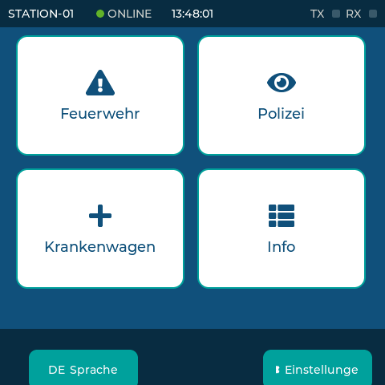
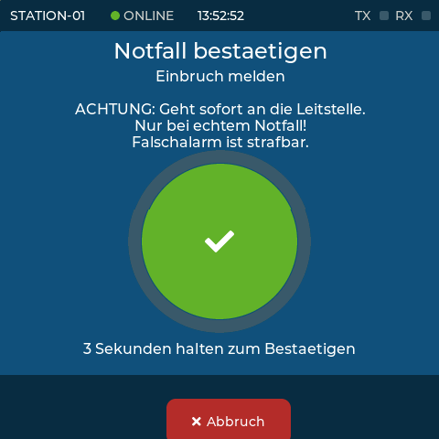
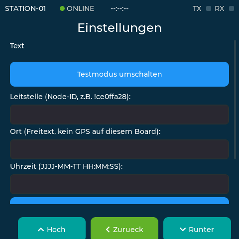

<div align="center">

# kayna-funkt Notmeldeterminal (vibe coded prototype)


Ein Meshtastic-basiertes Notmeldeterminal für abgesetzte Standorte ohne
Mobilfunk-/Internetanbindung — Teil des Notmeldestellen-Projekts **kayna-funkt**.

Das Projekt baut in erster Linie ein **Interface**: eine Sammlung Logik
(Lagemeldungen strukturiert speichern, Absender prüfen, echte Zustellbestätigung),
die unabhängig von der konkreten Hardware funktioniert. Welches Gerät die
Notmeldungen tatsächlich sendet, kann wechseln und soll in Zukunft erweiterbar
bleiben — aktuell laufen zwei Hardware-Wege, weitere sind ausdrücklich möglich.
Frühere Titel dieses Repos ("ESP32-S3 Interface for Meshtastic") beschrieben nur
noch den ersten der beiden — siehe [Wiki](https://github.com/Pixeldieb/kayna-funkt-notmeldeterminal/wiki)
für den aktuellen Gesamtüberblick in einfacher Sprache.

</div>

---

## 📋 Inhalt

- [Was macht dieses Projekt?](#-was-macht-dieses-projekt)
- [Architektur: ein Interface, mehrere Hardware-Ziele](#-architektur-ein-interface-mehrere-hardware-ziele)
- [Lagemeldungen (das gemeinsame Interface)](#-lagemeldungen-das-gemeinsame-interface)
- [SenseCAP Indicator — aktuelles Hauptziel](#-sensecap-indicator--aktuelles-hauptziel)
- [Historie: der erste Hardware-Weg (XIAO ESP32-S3 + XIAO nRF52)](#-historie-der-erste-hardware-weg-xiao-esp32-s3--xiao-nrf52)
- [Weiterführende Links](#-weiterführende-links)
- [Changelog](#-changelog)
- [Lizenz](#-lizenz)

---

## 🧭 Was macht dieses Projekt?

**Ziel:** Eingehende, speziell markierte Nachrichten ("Lagemeldungen") sollen
nicht nur als lose Chat-Nachricht im Mesh verpuffen, sondern strukturiert, mit
Änderungshistorie und mit einer echten Zustellbestätigung auf dem Gerät
gespeichert werden.

Diese Logik lebt in `src/common/` und ist absichtlich hardware-neutral:

| Modul | Aufgabe |
|---|---|
| `lage_db` | Lagemeldungen + Änderungshistorie in SQLite, plus optionaler Spiegel-Haken für ein Backup-Medium |
| `mesh_security` | Absender-Allowlist + Ratenbegrenzung — sicherer Default: leere Allowlist verwirft alles |
| `cobs` | Byte-Framing für interne UART-Verbindungen (z.B. zwischen zwei Chips auf einem Board) |

Jedes unterstützte Gerät bringt nur noch sein eigenes, kleines
hardware-spezifisches Stück Code mit (Funkmodul ansprechen, Bildschirm zeichnen,
Tasten lesen) und benutzt diese gemeinsame Logik. Das ist bewusst so gebaut,
damit sich später ein weiteres Gerät (z.B. ein reguläres Produktivgerät mit
anderer Hardware) anschließen lässt, ohne die Kernlogik neu zu schreiben.

---

## 🧩 Architektur: ein Interface, mehrere Hardware-Ziele

```
src/common/          <- Interface: hardware-neutrale Logik (s.o.)
src/sensecap/        <- Hardware-Ziel 1 (aktueller Fokus): eigenständiges Touchscreen-Terminal
src/sensecap_rp2040/ <- selbes Board, zweiter Chip: Micro-SD-Backup-Spiegel
src/xiao/            <- Hardware-Ziel 2 (Historie): serieller Prototyp, siehe unten
```

Jedes `[env:...]` in `platformio.ini` ist ein eigenständiges Firmware-Ziel, das
gegen dieselbe `src/common/`-Logik baut. Ein neues Hardware-Ziel hinzuzufügen
heißt: neuer Ordner unter `src/`, neue `[env:...]`-Sektion, Wiederverwendung von
`src/common/` — keine Änderung an der Kernlogik selbst nötig.

---

## 🚨 Lagemeldungen (das gemeinsame Interface)

Eingehende Nachrichten mit dem Prefix `LAGE:` werden erkannt, geparst und in
einer lokalen **SQLite-Datenbank** gespeichert — alle anderen Mesh-Nachrichten
werden ignoriert. Dieses Format und Datenmodell sind auf beiden aktuellen
Hardware-Zielen identisch (`src/common/lage_db`).

### Nachrichtenformat

```
LAGE:<ID|NEU>;<Kategorie>;<Status>;<Text>
```

**Neue Lagemeldung anlegen:**
```
LAGE:NEU;Brand;offen;Kellerbrand Mehrfamilienhaus Hauptstraße 12
```

**Bestehende Lagemeldung aktualisieren** (ID aus vorheriger Anlage, z.B. `1`):
```
LAGE:1;Brand;in Bearbeitung;Feuerwehr löscht, Nachbargebäude evakuiert
```

Trennzeichen ist bewusst **Semikolon** (`;`) statt Pipe — auf jeder Tastatur ohne
Umschalt-Kombination erreichbar, wichtig im Feldeinsatz.

### Datenmodell

| Tabelle | Zweck |
|---|---|
| `lagemeldungen` | Aktueller Stand jeder Lagemeldung (Kategorie, Status, Text, Absender, Zeitstempel) |
| `lage_historie` | Jede Änderung wird **vor** dem Überschreiben protokolliert (alter/neuer Text, alter/neuer Status, Zeitpunkt) — volle Nachvollziehbarkeit |

IDs laufen über SQLites eingebaute `rowid`, keine expliziten `PRIMARY KEY`/`UNIQUE`-Constraints
(bekannter Bibliotheks-Bug, siehe Changelog 2026-09-15).

---

## 📺 SenseCAP Indicator — aktuelles Hauptziel

Ein Seeed SenseCAP Indicator (D1L) mit 480×480-Touchscreen: Menü, Notfall-Flow,
Datenbank und Funkverbindung laufen alle auf **einem** Board — im Unterschied
zum historischen Zwei-Board-Weg weiter unten braucht dieses Ziel kein externes
Funkgerät.

Build/Flash: `pio run -e sensecap_indicator -t upload`

<p align="center">
  
  
  
</p>
<p align="center"><em>Echte Screenshots vom laufenden Gerät (kein Mockup) — mehr Screens in <a href="src/sensecap/README.md#screenshots">src/sensecap/README.md</a>.</em></p>

Ausführliche Doku (Hardware-Bring-up-Story, bekannte Gotchas, Architektur,
aktueller Stand der Meshtastic-Anbindung): **[src/sensecap/README.md](src/sensecap/README.md)**.

Kurzstand: Display/Touch/Menü/Datenbank laufen stabil. Meshtastic-Anbindung läuft
über den eingebauten SX1262 mit echtem Meshtastic-Protokoll (Paketformat,
Verschlüsselung, Kanal-Hash — kein rohes/inkompatibles Signal) und ist gegen ein
reales Meshtastic-Gerät verifiziert: Broadcast bidirektional, Direktnachricht mit
einem echten **Anwendungs-ACK** (`LAGE:ACK:<id>`, nicht nur ein Transport-ACK —
ein Transport-ACK bestätigt nur, dass ein Paket irgendwo ankam, nicht dass die
Leitstelle es inhaltlich akzeptiert hat; siehe Changelog 2026-09-18 "B5") an eine
konfigurierbare Leitstelle.

Seit 2026-09-21 zusätzlich: eine PIN-geschützte Einstellungen-Seite am
Touchscreen (Leitstelle, Ort, Uhrzeit — siehe Wiki
[SenseCAP-Einstellungen](https://github.com/Pixeldieb/kayna-funkt-notmeldeterminal/wiki/SenseCAP-Einstellungen)),
und eine Sicherungskopie jeder Lagemeldung auf einer Micro-SD-Karte über den
RP2040-Co-Prozessor des Boards (`env:sensecap_rp2040`) — die SQLite-Datenbank
bleibt dabei die führende Quelle, die SD-Karte ist reines Backup.

Details im [Wiki](https://github.com/Pixeldieb/kayna-funkt-notmeldeterminal/wiki/SenseCAP-Meshtastic)
und in [Issue #36](https://github.com/Pixeldieb/kayna-funkt-notmeldeterminal/issues/36).

---

## 🕰️ Historie: der erste Hardware-Weg (XIAO ESP32-S3 + XIAO nRF52)

Der Ausgangspunkt dieses Projekts, bevor SenseCAP Indicator dazukam: zwei
kleine Platinen auf einem Steckbrett — ein **XIAO ESP32-S3** ("Interface-Board",
führt den Code aus `src/xiao/` aus, hat aber kein eigenes Funkmodul) und ein
**XIAO nRF52** ("Funkgerät", läuft mit unveränderter offizieller
Meshtastic-Firmware und übernimmt das Funken), verbunden über eine serielle
Leitung.

Funktioniert weiterhin, ist aber bewusst zurückgestellt (Entscheidung
2026-09-18): der Handshake zwischen den beiden Platinen ist im Feldtest nicht
immer stabil ([Issue #35](https://github.com/Pixeldieb/kayna-funkt-notmeldeterminal/issues/35)),
und SenseCAP braucht dieses zweite Gerät gar nicht erst. Bleibt als
funktionierende Referenz bestehen.

Hardware, Verkabelung, Software-Setup, Zustandsmodell und Troubleshooting im
Detail: **[src/xiao/README.md](src/xiao/README.md)**.

Build/Flash: `pio run -e seeed_xiao_esp32s3 --target upload`

---

## 🔗 Weiterführende Links

- [Projekt-Wiki](https://github.com/Pixeldieb/kayna-funkt-notmeldeterminal/wiki) — Status-Dashboard über beide Boards und alle Themenbereiche, in einfacher Sprache
- [Seeed XIAO ESP32-S3 – Getting Started](https://wiki.seeedstudio.com/xiao_esp32s3_getting_started/)
- [Meshtastic – Offizielle Dokumentation](https://meshtastic.org/docs/)
- [Meshtastic – Serial Module Konfiguration](https://meshtastic.org/docs/configuration/module/serial/)
- [Meshtastic-Arduino Library (GitHub)](https://github.com/meshtastic/Meshtastic-arduino)
- [Sqlite3Esp32 Library (GitHub)](https://github.com/siara-cc/esp32_arduino_sqlite3_lib)
- [PlatformIO Dokumentation](https://docs.platformio.org/)

---

## 📝 Changelog

### 2026-09-22

- **Diese README neu geordnet**: Projekt wird jetzt zuerst als hardware-neutrales
  Interface (`src/common/`) beschrieben, SenseCAP Indicator als aktuelles
  Hauptziel nach oben geholt, der XIAO-Weg klar als Historie abgesetzt (vorher
  stand die README noch komplett aus XIAO-Sicht, ein Rest aus der Umbenennung).
  Dabei außerdem korrigiert: die Zustellbestätigungs-Beschreibung für SenseCAP
  nannte noch das alte Transport-ACK (`ROUTING_APP`), das schon am 2026-09-18
  als Sicherheitslücke gefixt wurde (siehe unten, "B5") — beschrieb also einen
  längst überholten Stand als aktuell.
- **XIAO-Namensverwechslung aufgelöst**: "XIAO-Board" meinte bisher uneinheitlich
  zwei verschiedene physische Geräte — das XIAO-ESP32-S3-Interface-Board (kein
  eigenes Funkmodul) und das XIAO-nRF52-Funkgerät (echte Meshtastic-Firmware).
  Ab jetzt überall ausgeschrieben.
- **Nachgezogen**: die Micro-SD-Sicherungskopie und das Uhrzeit-Feld (beide
  2026-09-21 gebaut) fehlten hier komplett — eigene Changelog-Einträge
  ergänzt. Der XIAO-Abschnitt war trotz "Historie"-Überschrift weiterhin der
  längste Teil der Datei (Hardware, Verkabelung, Software-Setup, Troubleshooting
  — alles ausführlich); nach `src/xiao/README.md` ausgelagert, analog zu
  `src/sensecap/README.md`, damit die Gewichtung der Datei zur tatsächlichen
  Priorität passt. Kaputtes Badge ohne Farbe/Aufbau entfernt.

### 2026-09-21

- **Micro-SD-Sicherungskopie für Lagemeldungen**: die Meldungen werden
  zusätzlich zur SQLite-Datenbank auf eine Micro-SD-Karte gespiegelt. Die Karte
  hängt am RP2040-Co-Prozessor des SenseCAP-Boards, nicht am ESP32-S3 — dafür
  eine neue, eigenständige RP2040-Firmware (`env:sensecap_rp2040`), die über
  eine eigene UART-Verbindung mit dem ESP32-S3 spricht. Die SQLite-Datenbank
  bleibt die führende Quelle, die SD-Karte ist reines Backup, kein Ersatz.
  Details im [Wiki/Hardware-Bringup](https://github.com/Pixeldieb/kayna-funkt-notmeldeterminal/wiki/Hardware-Bringup).
- **Uhrzeit per Touchscreen stellbar**: neues Feld auf der
  Einstellungen-Seite, weil das Gerät weder einen batteriegepufferten
  Uhrenbaustein noch NTP/GPS hat und die Uhr vorher nur per Serial-Kommando
  korrigierbar war — ohne Laptop im Feld also gar nicht. Die Uhr läuft danach
  weiterhin mit der Zeit auseinander (kein Präzisions-Uhrenbaustein verbaut),
  das Feld macht sie nur wieder korrigierbar. Details im
  [Wiki/SenseCAP-Einstellungen](https://github.com/Pixeldieb/kayna-funkt-notmeldeterminal/wiki/SenseCAP-Einstellungen).

### 2026-09-18

- **SenseCAP Indicator: echtes Meshtastic-Protokoll** über den eingebauten SX1262
  (nicht mehr nur rohes LoRa) — Paketheader, AES128-CTR-Verschlüsselung, Protobuf-
  Payload und Kanal-Hash exakt nach `meshtastic/firmware`s eigenem Quellcode
  nachgebaut (Frequenz/BW/SF/CR/Sync/Präambel ebenso). Protobuf-Definitionen nicht
  handkodiert, sondern nanopb + Meshtastics eigene generierte Header vendored
  (`lib/meshtastic_proto/`). Details: [src/sensecap/README.md](src/sensecap/README.md)
  Abschnitt 5, [Issue #36](https://github.com/Pixeldieb/kayna-funkt-notmeldeterminal/issues/36).
- Die alte externe-Node-Bridge (`meshtastic_bridge.h/.cpp`, Weg 2) für dieses Board
  entfernt — endgültig nicht machbar (kein freier GPIO, RP2040-Co-Prozessor hat keine
  Hardware-Verbindung zum SX1262, siehe Board-README).
- **Live gegen ein echtes Meshtastic-Gerät verifiziert** (Folgesession, selber Tag):
  Broadcast bidirektional bestätigt, danach zwei reale Blocker gefunden und behoben —
  moderne Firmware lehnt nicht-PKI-Direktnachrichten auf `TEXT_MESSAGE_APP` ab
  ("legacy DM", Fix: eigener `PRIVATE_APP`-Portnum), und Broadcasts werden nie
  bestätigt (Fix: eigener privater Kanal + Direktnachricht mit ACK an eine
  konfigurierbare Leitstelle — siehe "B5" direkt unten für den entscheidenden
  Nachfolge-Fund am selben Tag). NodeInfo-Austausch ergänzt. Nebenbei einen
  unabhängigen, bis dahin unbemerkten Bug gefunden: `lageDbBegin()` fehlte auf
  diesem Board komplett, die Notmeldungshistorie lief seit Board-Einführung ins
  Leere. Details im [Wiki](https://github.com/Pixeldieb/kayna-funkt-notmeldeterminal/wiki/SenseCAP-Meshtastic).
- **B5 (kritisch): Transport-ACK ≠ echte Zustellung.** Das anfängliche
  `ROUTING_APP`-ACK von oben bestätigt nur, dass ein Paket auf Transport-Ebene
  irgendwo ankam — nicht, dass die Leitstelle es inhaltlich akzeptiert hat. Es
  wird sogar gesendet, *bevor* die empfangende Seite überhaupt ihre
  Sicherheitsprüfung durchläuft. Live reproduziert: ein fremder Node im Mesh
  konnte fälschlich als "Leitstelle bestätigt" durchgehen. Fix: ein echtes
  Anwendungs-ACK (`LAGE:ACK:<hex packetId>`), das die empfangende Seite erst nach
  erfolgreicher `meshSecurityCheck()` *und* DB-Speicherung sendet, mit Prüfung
  dass es wirklich vom konfigurierten Leitstellen-Node kommt. Details:
  [src/sensecap/README.md](src/sensecap/README.md) Abschnitt 5.6,
  [Wiki/Sicherheit](https://github.com/Pixeldieb/kayna-funkt-notmeldeterminal/wiki/Sicherheit).
- **Sicherheitslücken aus der Codebase-Analyse geschlossen** ([#1](https://github.com/Pixeldieb/kayna-funkt-notmeldeterminal/issues/1),
  [#3](https://github.com/Pixeldieb/kayna-funkt-notmeldeterminal/issues/3)): eingehende
  Lagemeldungen (und auf dem XIAO-ESP32-S3-Interface-Board die Zustands-Kurzcodes)
  wurden von jedem Absender ungeprüft übernommen. Neues gemeinsames Modul
  `src/common/mesh_security.h` mit Absender-Allowlist (sicherer Default: leer =
  alles verwerfen, nicht alles erlauben) und Ratenbegrenzung, in beide Boards
  eingebaut.
- **Heartbeat-Telemetrie** ([#13](https://github.com/Pixeldieb/kayna-funkt-notmeldeterminal/issues/13)):
  SenseCAP-Board sendet periodisch einen Status-Broadcast, damit eine Leitstelle
  eine ausgefallene Station am ausbleibenden Lebenszeichen erkennt — ehrlich ohne
  Akku-/Sabotage-Werte, da dafür noch keine Sensorik existiert.

### 2026-09-17

- **Zweites Board: Seeed SenseCAP Indicator (D1L)** — eigenständiges Touchscreen-
  Terminal (480×480, ST7701S/FT6336U), `env:sensecap_indicator` in `platformio.ini`.
  Menü/Notfall-Flow (Auswahl → Bestätigung mit Halte-Geste → Senden → Erfolg/
  Fehlschlag), Lagemeldungen in SQLite (wiederverwendet vom XIAO-ESP32-S3-Interface-
  Board), Statusleiste, Notmeldungshistorie. Details: [src/sensecap/README.md](src/sensecap/README.md).
- Umfangreiches Hardware-Bring-up nötig: Bootloop-Ursachen (PSRAM-/Flash-Modus,
  Partitionstabelle), auf dem Kopf montiertes Panel, und Rendering-Glitches durch
  fehlenden Doppelpuffer (behoben über Cache-Writeback + Frame-Sync-Callback +
  reduzierten Pixeltakt) — siehe Board-README für die volle Fehlersuche-Geschichte.
- Meshtastic-Anbindung für das neue Board: eingebautes SX1262 sendet/empfängt jetzt
  zuverlässig rohes LoRa (Reset-Settle-Timing-Fix, nicht das vermutete BUSY-Timing).
  Externe Node über UART bleibt aus GPIO-Mangel verworfen. Echte Meshtastic-Protokoll-
  Kompatibilität (Verschlüsselung/Routing/Kanäle) ist der jetzt eigentliche offene
  Punkt — strategische Scope-Frage, dokumentiert in [Issue #36](https://github.com/Pixeldieb/kayna-funkt-notmeldeterminal/issues/36).
- `src/` neu strukturiert für mehrere Boards: `src/xiao/`, `src/common/`
  (gemeinsam genutztes `lage_db`), `src/sensecap/`.

### 2026-09-16

- **Zustandsmodell der Säule ergänzt** (STANDBY/AKTIV/STROMAUSFALL/WARTUNG/SABOTAGE), abfragbar per neuem Serial-Befehl `status`
- Zustandswechsel per Kurz-Code als Mesh-Broadcast (`LGE`, `NOR`, `WTG`, `SAB`, `SAUS`) — bewusst kurz und ohne Alltagswörter, um Tippfehler/versehentliches Auslösen zu vermeiden
- Feature-Roadmap strukturiert: Aufteilung in drei Repos (Mesh-Brain hier, [notfallbox-update-station](https://github.com/Pixeldieb/notfallbox-update-station) für Captive Portal/OTA, privates `notmeldestelle-leitstelle-spec` für die Leitstellen-Schnittstelle), Milestones „MVP Feldtest Kayna/Zeitz" und „Post-Pilot"
- `upload_speed` in `platformio.ini` auf 115200 gesenkt (460800 war beim Flashen über USB unzuverlässig)

### 2026-09-15

- Grundgerüst: ESP32-S3 ↔ Meshtastic-Node über D6/D7 (UART, gekreuzt), Verbindungsaufbau mit vollständigem Handshake-Wait
- LED-Statusanzeige (Warte-/Erfolgs-/Sende-/Heartbeat-Muster) über die eingebaute LED
- Test-Sendung im festen Intervall (zuletzt: alle 5 Minuten)
- Meshtastic-Node per CLI vollständig eingerichtet (Region, Serial-Modul, Owner, Kanal-Check)
- **Lagemeldungen-Feature ergänzt:** eingehende `LAGE:`-Nachrichten werden geparst und gespeichert
  - Nachrichtenformat zunächst mit Pipe (`|`), auf Anwenderwunsch auf Semikolon (`;`) umgestellt
  - Speicherung zunächst als JSON-Datei (LittleFS + ArduinoJson) prototypisch umgesetzt
  - Auf Wunsch durch echte relationale Datenbank ersetzt: SQLite (`Sqlite3Esp32`) mit zwei Tabellen (`lagemeldungen`, `lage_historie`) für Filterung, Kategorien und vollständige Änderungshistorie
  - Serial-CLI-Befehle (`liste`, `liste kategorie`, `liste status`, `detail`) zum Prüfen ohne zusätzliches Interface
  - Bug behoben: `disk I/O error` durch `PRIMARY KEY`/`UNIQUE`-Constraints auf SPIFFS (bekannter Library-Bug) — Schema auf implizite `rowid` umgestellt
- Wissensdatenbank-Artikel in Odoo Knowledge angelegt und laufend um Node-Vorbereitung (CLI-Checks, Einstellungen, Firmware-Update-Weg für XIAO nRF52840) erweitert

---

## 📄 Lizenz

Siehe [LICENSE](./LICENSE).
